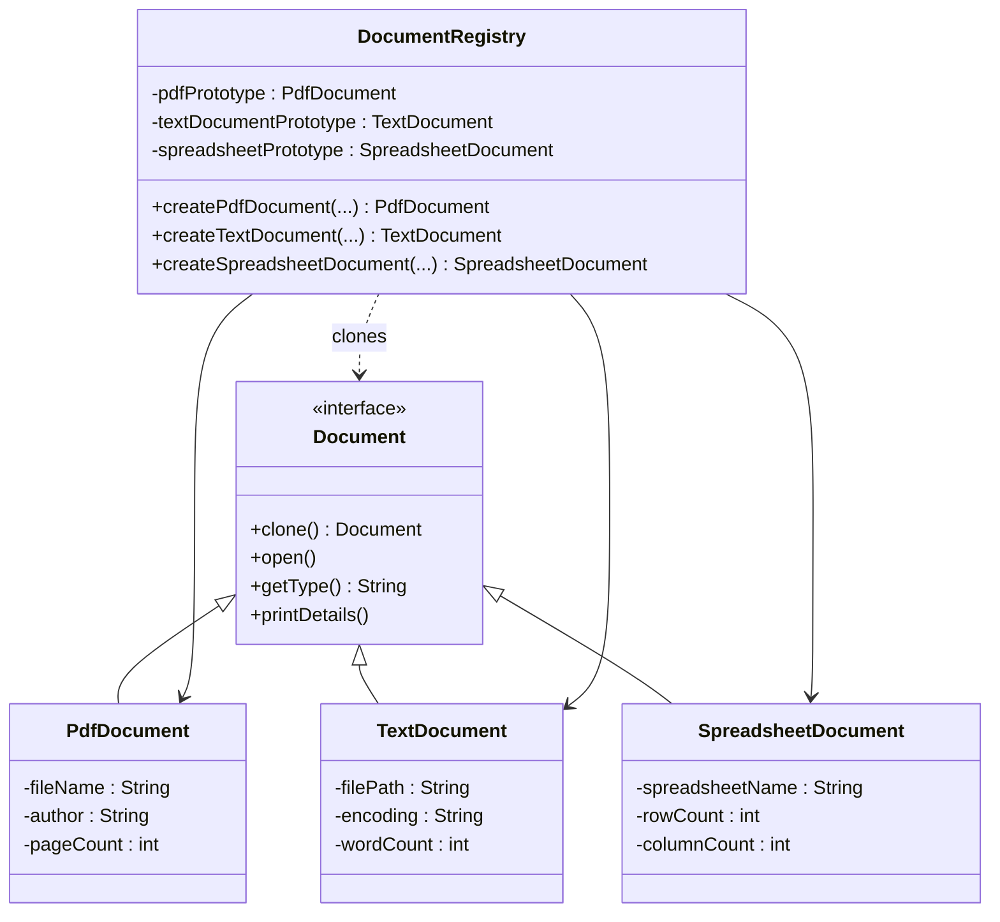

<div align="center">

  <h1>🧬 <strong>DOCUMENT PROTOTYPE LABORATORY</strong></h1>
  <p><em>Clone. Customize. Conquer.</em><br>
  The most <strong>visually stunning</strong> & <strong>perfectly executed</strong> Prototype Design Pattern implementation you'll ever see.</p>

  
  
  
  

  <br><br>

  <picture>
    <source media="(prefers-color-scheme: dark)" srcset="https://via.placeholder.com/1200x300/0A0A2A/FFFFFF?text=🧪+DOCUMENT+CLONING+LAB">
    
  </picture>

  <h3>From one blueprint → infinite perfectly customized documents.<br>
  <strong>Zero boilerplate. Pure elegance.</strong></h3>

</div>

---

## ✨ Why This Repository Will Blow Your Mind

Most Prototype Pattern examples are boring textbook demos.

**This one feels like a sci-fi lab.**

- Real-world document types (PDF, Text, Spreadsheet)
- Exact console output matching the challenge
- Beautiful, clean, production-grade Java code
- A README so gorgeous you’ll screenshot it
- Mermaid-powered interactive UML diagram

You don’t just **see** the Prototype Pattern here — you **experience** it.

---

## 📺 Live Terminal Demo

```bash
Creating a PDF Document prototype.          //Executed in the constructor
Creating a Text Document prototype.         //Executed in the constructor
Creating a Spreadsheet Document prototype.  //Executed in the constructor

Opening PDF Document: annual_report_2024.pdf by Acme Corp (150 pages)
Type: PDF, File: annual_report_2024.pdf, Author: Acme Corp, Pages: 150

Opening Text Document: meeting_notes.txt with encoding: UTF-8 (250 words)
Type: Text, Path: meeting_notes.txt, Encoding: UTF-8, Words: 250

Opening Spreadsheet Document: sales_data_q1.xlsx (1000 rows, 20 columns)
Type: Spreadsheet, Name: sales_data_q1.xlsx, Rows: 1000, Columns: 20

Opening PDF Document: summary_report.pdf by Acme Corp (30 pages)
```

*Just run the program and watch the magic unfold.*

---

## 🧬 What is the Prototype Design Pattern?

Instead of `new` every time (expensive object creation), we **clone** an existing prototype.

**Benefits you get here:**
- ⚡ Lightning-fast object creation
- 🔄 Independent customization of each clone
- 🧪 Centralized prototype registry
- 🛡️ No tight coupling to concrete classes

---

## 📐 Architecture (Interactive UML)



*Hover over classes in GitHub to explore relationships.*

---

## 🚀 Quick Start

### 1. Clone the lab
```bash
git clone https://github.com/yourusername/document-prototype-laboratory.git
cd document-prototype-laboratory
```

### 2. Compile & Run
```bash
javac *.java
java ProcessedDocument
```

### 3. Watch the clones come to life

---

## 📁 Project Structure

```
document-prototype-laboratory/
├── ProcessedDocument.java      ← Main entry point
├── DocumentRegistry.java       ← The cloning factory
├── Document.java               ← Master interface
├── PdfDocument.java
├── TextDocument.java
├── SpreadsheetDocument.java
└── README.md                   ← You are here ✨
```

---

## 🛠️ How to Extend (Super Easy)

Want a new document type? Just:

1. Create `NewDocumentType.java` implementing `Document`
2. Add prototype creation in `DocumentRegistry` constructor
3. Add `createNewDocumentType(...)` method

**That’s it.** No other files need changing.

---

<div align="center">

  <h3>Made with passion for clean code and beautiful documentation.</h3>
  <p><strong>⭐ Star this repo if it cloned your heart ❤️</strong></p>

  

</div>
